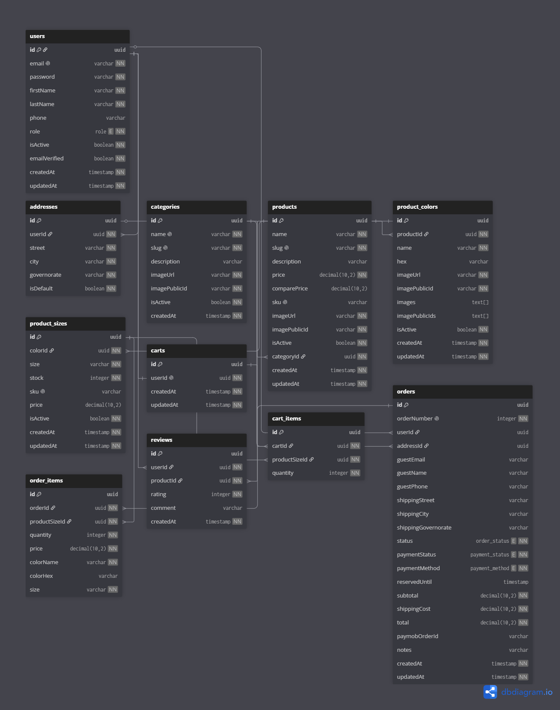

# C-Store 🛍️

A **production-ready** e-commerce platform for a premium fashion store — full shopping flow (catalog, variants,
cart, checkout, payments, orders) plus an admin dashboard. Built as a TypeScript monorepo with production concerns
baked in: secure auth, concurrency-safe orders, idempotent payments, automated CI/CD, and off-site backups.

🔗 **Repo:** [github.com/AhmedGamall1/C-store](https://github.com/AhmedGamall1/C-store)


---

## ✨ Features

- **Catalog with variants** — products → colours → sizes, where each size is the real SKU that carries stock.
- **Cart** — works for guests (local) and logged-in users (persisted), with cart merge on login.
- **Checkout** — cash-on-delivery **and** Paymob card payments; guest and user checkout.
- **Idempotent orders** — an `Idempotency-Key` prevents duplicate orders on double-click or retry.
- **Concurrency-safe inventory** — race-safe stock decrement, stock reservation, and an auto-expiry job.
- **Payments** — Paymob iframe + **HMAC-verified, idempotent** webhook; failed payments restock automatically.
- **Auth** — short access token + **rotating refresh token** (reuse detection), email verification, password reset, RBAC.
- **Admin dashboard** — manage categories, products, variants, stock, and orders.
- **Image uploads** — product images served via Cloudinary CDN.
- **Hardened** — Helmet, Zod validation, distributed (Redis) rate limiting, nightly off-site DB backups.

---

## 🧱 Tech stack

| Layer | Technology |
|---|---|
| **Frontend** | React 19, Vite, React Router 7, TanStack Query, React Hook Form, Zod, Tailwind, Radix UI |
| **Backend** | Node.js, Express 5, TypeScript, Prisma 7, Zod |
| **Data** | PostgreSQL, Redis |
| **Infra** | Docker, Docker Compose, Caddy, Cloudflare, GitHub Actions, GHCR, Backblaze B2 |
| **Integrations** | Paymob (payments), Cloudinary (images), Gmail SMTP (email) |
| **Testing** | Vitest, Supertest |

---

## 🏗️ Architecture


C-Store is a **monolith** deployed as Docker containers on a single Linux VPS. Cloudflare provides the CDN and
TLS edge; Caddy is the reverse proxy; the Express API owns the business logic; PostgreSQL is the source of truth;
and Redis holds all ephemeral state (sessions, tokens, idempotency keys, rate-limit counters).

📄 Full write-up: **[docs/architecture.md](docs/architecture.md)**

### Design pattern — Layered architecture

The backend follows a **layered architecture** with the **repository pattern**:

```
Route  →  Controller  →  Service  →  Repository  →  Database
         (HTTP only)   (business    (data access)
                         logic)
```

- **Controller** — handles HTTP only (reads the request, sends the response).
- **Service** — the business logic and rules.
- **Repository** — the only layer that talks to the database (via Prisma).

**Why:** each layer has a single responsibility, which makes the code easy to **test** (services without HTTP),
**change** (swap data access without touching logic), and **reuse** (a background job and a controller call the
same service).

---

## 🗄️ Database



Source (dbdiagram.io DBML): **[docs/erd.dbml](docs/erd.dbml)**

---

## 📁 Project structure

```
.
├── apps/
│   ├── client/        # React + Vite storefront and admin dashboard
│   └── server/        # Express + Prisma REST API
├── packages/
│   └── shared/        # shared code
├── infra/             # Caddyfile, Postgres backup/restore scripts
├── docs/              # architecture diagram + ERD
└── docker-compose*.yml
```

The API is organized by layer: `routes/ · controllers/ · services/ · repositories/ · schemas/ · middlewares/`.

---

## 🚀 Getting started (local)

**Prerequisites:** Node.js 20+, Docker.

```bash
# 1. Clone
git clone https://github.com/AhmedGamall1/C-store.git
cd C-store

# 2. Configure environment
cp .env.example .env        # then fill in the values

# 3. Start Postgres + Redis
docker compose up -d

# 4. Install dependencies
npm install

# 5. Run database migrations
npm run db:migrate -w apps/server

# 6. Start the app (client + server)
npm run dev
```

- Client: <http://localhost:5173>
- API: <http://localhost:5000>

> The `.env` holds your database, Redis, JWT, Paymob, Cloudinary, and Gmail settings. See `.env.example` for the full list.

---

## 📜 Scripts

| Command | Description |
|---|---|
| `npm run dev` | Run client + server in watch mode |
| `npm test` | Run the server test suite (Vitest) |
| `npm run lint` | Lint the codebase |
| `npm run db:migrate -w apps/server` | Apply database migrations |
| `npm run db:studio -w apps/server` | Open Prisma Studio |

---

## 🧪 Testing

Integration and unit tests with **Vitest + Supertest** cover the main flows — auth, cart, orders, products,
addresses, and the Paymob webhook — running against a disposable test database.

```bash
npm test
```

---

## 📦 Deployment

The project is configured for production deployment: **GitHub Actions** builds the client and server Docker images
→ pushes them to **GHCR** → SSHes into the VPS and runs `docker compose pull && up -d`. It is set up to run behind
**Caddy** (automatic HTTPS) with **Cloudflare** in front, with nightly PostgreSQL backups to **Backblaze B2**.

---

## 👤 Author

**Ahmed Gamal** — [GitHub](https://github.com/AhmedGamall1)
