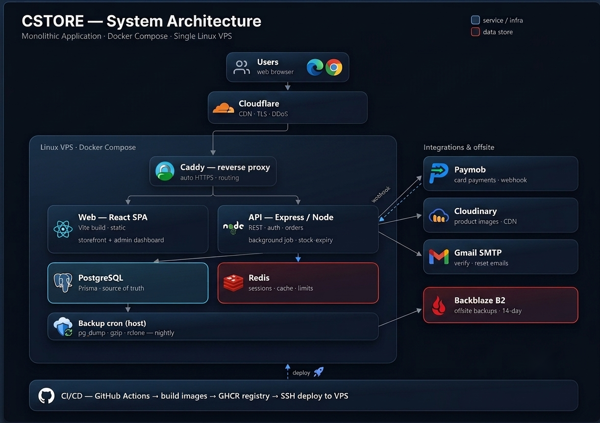

# C-Store — System Architecture

C-Store is a production e-commerce platform for a premium fashion store in Egypt. It covers the full
shopping flow — catalog with product variants, cart (guest **and** logged-in), checkout with cash-on-delivery
and online card payments, the order lifecycle, and an admin dashboard for products, inventory, and orders.

It is built as a TypeScript monorepo and deployed as Docker containers on a **single Linux VPS**, behind a
Caddy reverse proxy and a Cloudflare CDN.

---

## 1. Tech stack

| Layer | Technology |
|---|---|
| **Frontend** | React 19, Vite, React Router 7, TanStack Query, React Hook Form, Zod, Tailwind, Radix UI |
| **Backend** | Node.js, Express 5, TypeScript, Prisma 7, Zod |
| **Data** | PostgreSQL, Redis |
| **Infra** | Docker, Docker Compose, Caddy, Cloudflare, GitHub Actions, GHCR, Backblaze B2 |
| **Integrations** | Paymob (payments), Cloudinary (images), Gmail SMTP (email) |
| **Testing** | Vitest, Supertest |

---

## 2. Requirements

**Functional**
- Browse and filter products with **colour/size variants** (each size is the actual SKU that carries stock).
- Cart for both **guests** (local) and **logged-in users** (persisted), with cart merge on login.
- Checkout with **COD** and **Paymob card** payments; guest and user checkout.
- Order lifecycle with a strict status state machine; customer order history; admin order management.
- Admin CRUD for categories, products, variants, and stock.
- Auth: register, login, email verification, password reset, session refresh.

**Non-functional**
- **Secure** — auth, input validation, rate limiting, signed webhooks, hashed tokens.
- **Correct under concurrency** — no oversold stock, no duplicate orders, idempotent payment webhooks.
- **Available** — health checks, container auto-restart, nightly off-site backups.
- **Fast** — CDN for assets/images, short request paths, caching for hot reads.
- **Maintainable** — layered architecture with clear separation of concerns.

---

## 3. Components

| Component | Role | Why this choice |
|---|---|---|
| **Cloudflare** | CDN, TLS at the edge, DDoS protection | Free, global edge; offloads static delivery and shields the origin |
| **Caddy** | Reverse proxy; automatic HTTPS; routes `/` → web and `/api` → API | Auto-renewing certs with near-zero config |
| **Web (React SPA)** | Storefront **and** admin dashboard; static build served by Caddy | SPA + TanStack Query for a fast, cached client |
| **API (Express/Node)** | REST API, business logic, auth, orders; in-process **stock-expiry job** | Simple, well-understood, fast to ship |
| **PostgreSQL** | Source of truth (users, products, orders…) via Prisma | Relational integrity + transactions for money/stock |
| **Redis** | Refresh-token sessions, email/reset tokens, order idempotency, rate-limit counters *(catalog caching planned)* | One fast in-memory store for all ephemeral state |
| **Backup cron** | Nightly `pg_dump → gzip → rclone` to Backblaze B2 (14-day retention) | Cheap, automated, off-site disaster recovery |
| **Paymob / Cloudinary / Gmail** | Payments / image hosting+CDN / transactional email | Managed services for non-core concerns |

The API itself is layered: **routes → controllers (HTTP) → services (business logic) → repositories (data access)**.

---

## 4. Key flows

### 4.1 Authentication & sessions
- **Short access token (15 min) + rotating refresh token (30 days)**, both in `httpOnly` cookies.
- Refresh tokens live in Redis as a **session family**; each refresh **rotates** the token and **detects reuse**
  (an old token replayed ⇒ the whole family is revoked). This gives **real logout** and theft detection.
- **Email verification** and **password reset** use single-use, hashed tokens stored in Redis with a TTL.
- Passwords hashed with **bcrypt**; role-based access control (`CUSTOMER` / `ADMIN`).

### 4.2 Checkout & inventory (concurrency-safe)
- The order, its items, the stock decrement, and cart clearing run in **one database transaction** (all-or-nothing).
- Stock is decremented with a **conditional `UPDATE … WHERE stock >= qty`** so two buyers can never oversell the last unit.
- Each order item stores a **snapshot** of price/colour/size, so historical orders survive later product edits.
- Card orders **reserve** stock for 30 minutes; an in-process **stock-expiry job** releases unpaid reservations.
- Create-order accepts an **`Idempotency-Key`** (stored in Redis) so a double-click or retry returns the *same* order.

### 4.3 Payments (Paymob)
- The API registers the order with Paymob and returns an iframe payment URL.
- The webhook is **HMAC-verified** (SHA-512) and **idempotent**: status changes use atomic conditional updates,
  so duplicate or out-of-order webhooks can't pay twice or restock twice. Failed payments **restock** inside a transaction.

### 4.4 Rate limiting & caching
- **Distributed rate limiting** backed by Redis — limits are global across instances and survive restarts.
- **Cache-aside** for the heaviest public reads (category list, product listing) — *planned next step*.

### 4.5 Backups
- A host cron streams `pg_dump` from the Postgres container, gzips it, and uploads to **Backblaze B2** via `rclone`,
  pruning both local and remote copies older than 14 days.

---

## 5. Data model

The relational schema (users, addresses, categories, products → colours → sizes, carts, orders, order items, reviews)
is documented separately:

- Diagram: [erd.png](erd.png)
- Source (dbdiagram.io DBML): [erd.dbml](erd.dbml)

---

## 6. Key design decisions & trade-offs

- **Monolith, not microservices.** One deployable is simpler to build, test, and operate at this scale. The code is
  still cleanly layered, so logic can be extracted later if needed.
- **Single VPS + Docker Compose, not Kubernetes.** Cheaper and far simpler to run for current traffic. The app is
  **stateless** (sessions, rate limits, and idempotency live in Redis), so it is *ready* to scale horizontally.
- **JWT access + refresh rotation, not a single long-lived JWT.** Enables real logout, revocation, and theft detection.
- **Redis as a multi-purpose store.** Sessions, tokens, idempotency, and rate limits share one fast store with TTLs.
- **Soft-delete for products.** Keeps historical orders intact and readable.

---

## 7. Scaling path

If traffic grew, the next steps would be:

1. **Run multiple API instances** behind a load balancer — already possible because all shared state is in Redis.
2. Move **PostgreSQL and Redis** to managed services; add **read replicas** for catalog reads.
3. Add a **message queue** for emails and webhook processing (decouple slow work from requests).
4. Add **observability** — Prometheus metrics + Grafana dashboards, and Sentry for error tracking.
5. Lean harder on **caching** (catalog cache-aside) and Cloudflare edge caching.

---

## 8. Security & reliability

- `helmet`, CORS allow-list, body-size limits, and **Zod** validation on all inputs.
- Auth in `httpOnly` cookies; **bcrypt** password hashing; **hashed, single-use** email/reset tokens.
- **HMAC-verified** payment webhooks; idempotent, concurrency-safe order updates.
- **Distributed rate limiting** on the API, with a stricter limit on auth endpoints.
- Stack traces hidden in production; **health-check** endpoint; **graceful shutdown** (drains requests, closes DB/Redis).
- Nightly **off-site backups** with retention.
